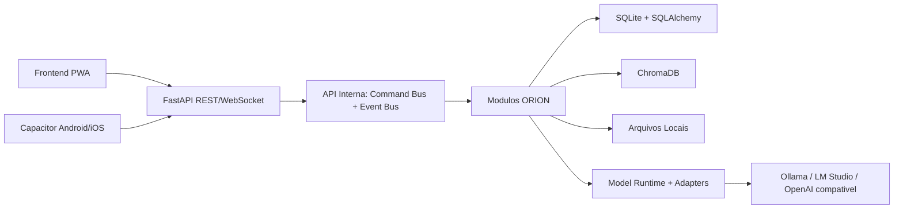

# ORION Architecture

## Visao Geral

ORION sera um ecossistema local-first. O backend FastAPI coordenara modulos independentes por uma API interna baseada em comandos e eventos. O frontend sera uma PWA responsiva com uma camada Three.js. A persistencia relacional usara SQLite por meio do SQLAlchemy e a memoria vetorial usara ChromaDB.

## Principios

1. Local-first: nenhum dado sai do dispositivo sem autorizacao explicita.
2. Modularidade: modulos nao chamam implementacoes internas de outros modulos.
3. Contratos: comunicacao interna por Command Bus, Event Bus e schemas versionados.
4. Menor privilegio: permissoes por papel, usuario, plugin e acao.
5. Recuperabilidade: backup antes de atualizacoes e operacoes destrutivas.
6. Observabilidade local: logs, metricas e auditoria ficam no dispositivo.
7. Evolucao incremental: um ticket verificavel por vez.
8. Portabilidade: recursos dependentes do SO passam por adapters e capacidades detectadas.

## Diagrama de Contexto



## Camadas Backend

| Camada | Responsabilidade |
| --- | --- |
| API externa | REST, WebSocket, autenticacao e validacao de entrada |
| API interna | comandos, eventos, mensagens e contratos entre modulos |
| Aplicacao | casos de uso e orquestracao |
| Dominio | regras de negocio por modulo |
| Infraestrutura | SQLAlchemy, ChromaDB, arquivos, Ollama, Vosk e SO |
| Jobs | APScheduler, Dream Mode, backup e verificacao de atualizacao |

## Modulos Planejados

| Modulo | Escopo |
| --- | --- |
| Core | bootstrap, configuracao, lifecycle e health checks |
| Tool System | registry, schemas, permissoes, confirmacao e auditoria de acoes |
| Identity | usuarios, perfis, JWT, permissoes e onboarding |
| Onboarding | primeira execucao, perfil criptografado e preferencias iniciais |
| Vault | segredos criptografados com AES-256-GCM |
| Telemetry | logs estruturados, metricas e rastreamento de falhas |
| Memory | curto prazo, longo prazo, preferencias, historico e ChromaDB |
| Brain | memoria, planejamento, execucao, aprendizado, conhecimento, Ollama futuro e fallback local |
| Model Runtime | registry de providers, selecao explicita e adapters Ollama/OpenAI compativel |
| Voice | Vosk, pyttsx3, wake word e parser de comandos |
| Finance | receitas, despesas, categorias, relatorios e exportacao |
| Planner | agenda, tarefas, metas, habitos e lembretes |
| Files | upload, download, organizacao e pesquisa |
| Knowledge | documentos, OCR, anotacoes, resumos e busca |
| Vision | camera, objetos, faces, QR Code e texto |
| Academy | lousa, disciplinas, simulados, flashcards e revisao espacada |
| Focus | etapas, temporizador, alertas, recompensas e resumos |
| Music | biblioteca MP3, playlists e integracao com voz/avatar |
| Avatar | Three.js, cenario, animacoes, emocoes e skins |
| Multiplayer | descoberta local, convites, sincronizacao e voz |
| Control | operacoes de PC protegidas por permissao administrativa |
| Plugins | SDK, marketplace local, permissoes, assinatura e hot reload |
| Backup | compactacao, restauracao, agendamento e verificacao |
| Update | versao, download seguro, backup, rollback e confirmacao |
| Export | PDF, CSV e JSON para dados permitidos |
| Notifications | navegador, Android e iOS |

## API Interna

Nenhum modulo deve importar servicos de outro modulo diretamente. A integracao ocorre por:

- `Command Bus`: pedido explicito com resultado esperado.
- `Event Bus`: publicacao de fatos ja ocorridos.
- `Message Bus`: mensagens assincronas e jobs.
- `Schemas versionados`: contratos Pydantic compartilhados.

Exemplos conceituais:

| Tipo | Nome | Produtor | Consumidor |
| --- | --- | --- | --- |
| Command | `finance.get_balance` | Brain | Finance |
| Command | `control.open_program` | Command Engine | Control |
| Event | `memory.summary.created` | Memory | Dream Mode |
| Event | `avatar.emotion.changed` | Brain | Avatar |
| Event | `backup.completed` | Backup | Telemetry |

## Estrutura Canonica Alvo

```text
orion/
  backend/
    app/
      api/
      core/
      internal_api/
      modules/
      infrastructure/
      jobs/
      main.py
    migrations/
    scripts/
  frontend/
    assets/
    src/
    index.html
    manifest.webmanifest
    service-worker.js
  mobile/
    android/
    ios/
    capacitor.config.ts
  plugins/
    sdk/
    marketplace/
    installed/
  data/
    sqlite/
    chroma/
    backups/
    logs/
  uploads/
  music/
  models/
    ollama/
    vosk/
    vision/
  platforms/
    web/
    linux/
    macos/
    android/
    ios/
  docs/
  tests/
    unit/
    integration/
    e2e/
    performance/
    security/
  AGENTS.md
  ARCHITECTURE.md
  BACKLOG.md
  DATABASE.md
  PROJECT_STATUS.md
  SECURITY.md
  TODO.md
```

## Decisoes Principais

| Decisao | Motivo | Consequencia |
| --- | --- | --- |
| FastAPI | API tipada, async e documentacao OpenAPI | Contratos devem ser tratados como interface publica |
| SQLite | instalacao simples e operacao local | Exige migracoes cuidadosas, WAL e backup consistente |
| SQLAlchemy | controle de sessoes e modelos | Toda alteracao estrutural passa por migration |
| ChromaDB | busca vetorial local persistente | Backup deve incluir armazenamento vetorial |
| WebSocket | eventos em tempo real | Precisa limite, autenticacao e protecao contra abuso |
| Three.js | cenario e avatar 3D no navegador | Precisa degradacao graciosa e teste de performance mobile |
| Capacitor | reutilizacao da PWA em mobile | Permissoes nativas precisam de matriz Android/iOS |
| APScheduler | jobs locais | Jobs precisam de idempotencia e auditoria |
| Adapters de plataforma | preservar Core entre Linux, macOS, Android, iOS e Web | capacidade ausente deve falhar de forma explicita |
| Adapters de modelos | preservar Brain entre Ollama, LM Studio, OpenAI compativel e providers futuros | fallback remoto automatico e proibido |

## Plataformas

A arquitetura multiplataforma esta detalhada em `PLATFORM_ARCHITECTURE.md`.

A arquitetura de modelos esta detalhada em `MODEL_ARCHITECTURE.md`.
