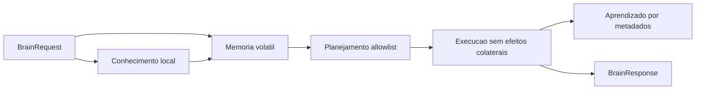

# ORION Brain

## Objetivo

Fornecer o nucleo de raciocinio local do ORION com responsabilidades pequenas,
testaveis e desacopladas. O baseline atual e deterministico: nao chama modelo externo,
nao persiste dados pessoais e nao executa efeitos colaterais.

## Componentes

| Componente | Pacote | Responsabilidade atual |
| --- | --- | --- |
| Memoria | `app/brain/memory.py` | manter contexto curto e volatil por conversa |
| Planejamento | `app/brain/planning.py` | classificar intencao e produzir plano por allowlist |
| Execucao | `app/brain/execution.py` | invocar ferramentas registradas para leitura, busca e composicao |
| Aprendizado | `app/brain/learning.py` | registrar somente metadados operacionais em memoria |
| Conhecimento | `app/brain/knowledge.py` | consultar entradas locais estaticas permitidas |

Orquestracao:



## API REST

Status:

```http
GET /api/brain/status
```

Processamento local:

```http
POST /api/brain/process
Content-Type: application/json

{
  "text": "Orion, status",
  "conversation_id": "local"
}
```

O campo `conversation_id` aceita somente letras, numeros, ponto, hifen e underscore.
A mensagem possui limite de 2000 caracteres.

## Allowlist De Execucao

O executor aceita exclusivamente:

| Acao | Uso |
| --- | --- |
| `context.read` | consultar memoria volatil da conversa |
| `knowledge.search` | consultar conhecimento local permitido |
| `response.compose` | produzir resposta textual local |

Qualquer outra acao gera `UnsafePlanError`. Abrir programas, controlar o host, acessar
arquivos, consultar rede, chamar plugins ou executar shell nao pertence ao Brain
baseline.

Cada passo permitido passa pela `ToolRegistry`. Consulte `TOOL_SYSTEM.md`.

## Restricoes De Seguranca

- uso somente em `localhost`;
- nao enviar dados sensiveis;
- nenhuma memoria persistente;
- nenhuma chamada de rede;
- nenhuma integracao com modelo externo;
- Model Runtime multi-provider declarado, mas nao invocado;
- nenhum efeito colateral;
- aprendizado limitado a intencao, resultado e quantidade de passos.

O endpoint de processamento e apropriado somente para desenvolvimento local da
fundacao. Autenticacao e autorizacao devem ser implementadas antes de persistencia,
LAN, tunel ou internet.

## Evolucao Planejada

| Ticket | Evolucao |
| --- | --- |
| T0006 | integrar Command Bus, Event Bus e Message Bus |
| T0009 | proteger endpoints com identidade e JWT |
| T0013-T0014 | substituir memoria volatil por ChromaDB e historico permitido |
| T0016 | integrar Orion Command Engine |
| T0017 | integrar Model Runtime multi-provider, fallback local e contexto persistente autorizado |
| T0018 | conectar aprendizado local permitido ao Dream Mode |

O baseline nao conclui `T0017`; ele prepara sua fronteira arquitetural sem atravessar
dependencias futuras.

O catalogo de providers e a politica de selecao estao em `MODEL_ARCHITECTURE.md`.

## Validacao

Executar testes focados:

```powershell
python -m pytest tests/test_brain.py tests/test_api.py
```

Executar todos os gates:

```powershell
powershell -ExecutionPolicy Bypass -File .\scripts\run_ci.ps1
```
