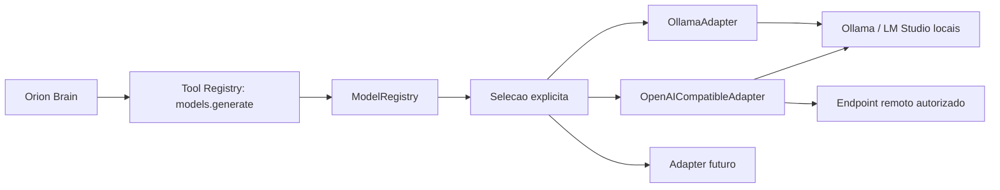

# ORION Model Runtime

## Objetivo

Preparar o ORION para usar multiplos providers de IA sem acoplar o Brain a um
servidor, protocolo ou modelo especifico. A fundacao atual declara contratos,
adapters e politicas de seguranca. Ela nao executa inferencia, nao descobre modelos
na rede e nao baixa pesos.

## Providers Declarados

| Provider | Protocolo | Endpoint inicial | Estado |
| --- | --- | --- | --- |
| `ollama-local` | Ollama nativo | `http://127.0.0.1:11434` | desabilitado |
| `lm-studio-local` | OpenAI compativel | `http://127.0.0.1:1234/v1` | desabilitado |
| `openai-compatible` | OpenAI compativel | configurado por `.env` | desabilitado |
| `future-provider-template` | customizado | adapter futuro | planejado |

O catalogo pode ser consultado localmente:

```http
GET /api/models
GET /api/models/status
```

## Componentes



| Arquivo | Responsabilidade |
| --- | --- |
| `app/model_runtime/models.py` | contratos estritos de providers, modelos e mensagens |
| `app/model_runtime/adapters.py` | envelopes Ollama e OpenAI compativel sem transporte |
| `app/model_runtime/registry.py` | registro, selecao, validacao de URL e catalogo sanitizado |
| `app/model_runtime/builtins.py` | providers declarados pela fundacao |
| `app/model_runtime/api.py` | catalogo REST somente leitura |

## Politica De Selecao

1. O modo inicial e `explicit-only`.
2. Nenhum modelo vem habilitado por padrao.
3. Um modelo somente pode ser resolvido quando modelo e provider estao habilitados.
4. Falha local retorna erro controlado ou usa fallback deterministico local.
5. Nunca trocar automaticamente para provider remoto.
6. Toda inferencia futura passa pela ferramenta registrada `models.generate`.

## Politica De Rede

Providers locais:

- aceitam somente `http://localhost`, `http://127.0.0.1` ou `http://[::1]`;
- rejeitam credenciais embutidas, query string e fragmento;
- nao sao consultados nesta fundacao.

Providers remotos:

- permanecem desabilitados por padrao;
- exigem opt-in explicito de runtime;
- exigem consentimento administrativo;
- exigem HTTPS;
- exigem host na allowlist;
- usam apenas referencia logica de credencial, nunca segredo em configuracao;
- nao sao acionados automaticamente em caso de falha local.

## Configuracao Inicial

```dotenv
MODEL_SELECTION_MODE=explicit-only
MODEL_EXTERNAL_CALLS_ENABLED=false
MODEL_REMOTE_HOST_ALLOWLIST=[]
OLLAMA_BASE_URL=http://127.0.0.1:11434
LM_STUDIO_BASE_URL=http://127.0.0.1:1234/v1
OPENAI_COMPATIBLE_BASE_URL=
OPENAI_COMPATIBLE_API_KEY_REF=
```

`OPENAI_COMPATIBLE_API_KEY_REF` deve apontar futuramente para um identificador do
Vault. O valor real nunca pertence ao `.env`, banco, log ou catalogo REST.

## Extensao Para Providers Futuros

Adicionar um provider exige:

1. implementar `ProviderAdapter`;
2. registrar protocolo e adapter no `AdapterRegistry`;
3. registrar provider com URL, escopo de rede e capacidades;
4. declarar permissao e confirmacao quando houver trafego externo;
5. criar testes de envelope, bloqueio, sanitizacao e falha;
6. revisar `THREAT_MODEL.md`.

## Fora De Escopo Desta Fundacao

- chamadas HTTP para inferencia;
- streaming de tokens;
- descoberta automatica de modelos;
- download, remocao ou troca dinamica de pesos;
- resolucao de credenciais no Vault;
- integracao do Brain com `models.generate`;
- retry, circuit breaker e telemetria de latencia.

Esses comportamentos pertencem ao ticket `T0017` e dependem de identidade, Vault,
auditoria e API interna.

## Referencias Oficiais

- [Ollama API](https://docs.ollama.com/api)
- [LM Studio OpenAI Compatibility API](https://lmstudio.ai/docs/developer/openai-compat)
- [OpenAI API Reference](https://platform.openai.com/docs/api-reference)
