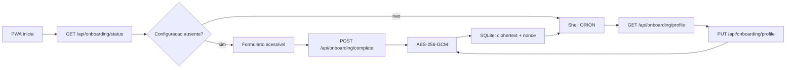

# ORION Onboarding

## Objetivo

Configurar a primeira experiencia do ORION sem armazenar dados pessoais ou credenciais
em texto puro. O fluxo aparece enquanto nenhuma configuracao inicial tiver sido
concluida neste dispositivo e pode ser reaberto depois pelo botao `Configuracoes`.

## Campos

| Campo | Valores | Uso |
| --- | --- | --- |
| nome | texto normalizado, maximo de 80 caracteres | apresentacao futura do assistente |
| preferencias | `concise`, `balanced`, `detailed` | estilo de resposta |
| perfil | `adult`, `child`, `elderly` | adaptacao futura da experiencia |
| voz | `calm`, `balanced`, `energetic` | configuracao futura de TTS |
| aparencia | `dark`, `light`, `high-contrast` | tema visual |
| senha administrativa | minimo de 10 caracteres | proteger edicao posterior da configuracao |

O baseline nao coleta email, telefone, endereco ou dado opcional sensivel. A senha
administrativa nunca e armazenada em texto puro e nunca e devolvida pela API.

## Fluxo



## API REST

Status sanitizado:

```http
GET /api/onboarding/status
```

Conclusao unica:

```http
POST /api/onboarding/complete
Origin: http://127.0.0.1:8000
Content-Type: application/json

{
  "name": "<local-name>",
  "response_style": "balanced",
  "profile": "adult",
  "voice": "calm",
  "appearance": "dark",
  "admin_password": "<senha-local>",
  "admin_password_confirmation": "<senha-local>"
}
```

A resposta informa somente se o fluxo foi concluido. Uma segunda conclusao recebe
`409 Conflict`.

Leitura sanitizada para edicao:

```http
GET /api/onboarding/profile
Origin: http://127.0.0.1:8000
```

Edicao posterior:

```http
PUT /api/onboarding/profile
Origin: http://127.0.0.1:8000
Content-Type: application/json

{
  "name": "<local-name>",
  "response_style": "balanced",
  "profile": "adult",
  "voice": "calm",
  "appearance": "dark",
  "current_admin_password": "<senha-atual>",
  "new_admin_password": "<nova-senha-opcional>",
  "new_admin_password_confirmation": "<nova-senha-opcional>"
}
```

`GET /profile` nunca retorna hash, salt, senha ou credencial administrativa.

## Criptografia

O armazenamento usa:

- AES-256-GCM;
- nonce aleatorio de 96 bits por gravacao;
- associated data versionada `orion:onboarding:v1`;
- ciphertext e nonce no SQLite;
- chave bootstrap binaria separada em `storage/keys/onboarding.key`;
- senha administrativa derivada por `PBKDF2-HMAC-SHA256` com salt aleatorio e
  `260000` iteracoes antes de entrar no payload criptografado;
- permissao de arquivo restrita ao usuario local por melhor esforco do SO;
- nenhum dado pessoal em log, cache PWA, `localStorage` ou `sessionStorage`.

### Limite Do Bootstrap

A chave local separada evita texto puro no SQLite, mas ainda nao substitui o Vault.
Quando `T0011` for concluido, a chave deve migrar para protecao pelo mecanismo seguro
do sistema operacional e pelo envelope de chaves descrito em `SECRETS_POLICY.md`.

O arquivo de chave:

- nao entra no Git;
- nao entra no pacote de distribuicao;
- nao deve ser copiado junto ao banco em backup sem protecao adicional;
- deve ser tratado como material criptografico sensivel.

## Banco

Instalacoes novas recebem a tabela `onboarding_profile` pelo schema atual. Instalacoes
existentes aplicam `database/migrations/0002_onboarding_profile.sql`, que e
idempotente e atualiza `schema_version` para `2`.

## Seguranca

- providers externos nao participam do fluxo;
- as rotas de conclusao, leitura e edicao exigem origem ou referer local permitido;
- enums controlados limitam configuracoes persistidas;
- edicao posterior exige senha administrativa atual;
- payload adulterado falha com erro sanitizado;
- o frontend recebe somente perfil sanitizado, sem credencial;
- autenticacao e Vault continuam obrigatorios antes de exposicao em LAN ou internet.

## Verificacao Manual

1. Iniciar `scripts/run_dev.ps1`.
2. Abrir `http://127.0.0.1:8000/`.
3. Confirmar que o formulario aparece em banco novo.
4. Preencher nome, preferencias, perfil, voz, aparencia e senha administrativa.
5. Concluir e confirmar abertura do shell.
6. Recarregar e confirmar que o formulario nao reaparece.
7. Abrir `Configuracoes`, informar senha atual e alterar preferencias.
8. Inspecionar `onboarding_profile` e confirmar ausencia de texto pessoal e senha.
9. Repetir com viewport movel e confirmar que o dialogo permite rolagem completa.

## Testes

```powershell
python -m pytest tests/test_onboarding.py tests/test_design_system.py
```
