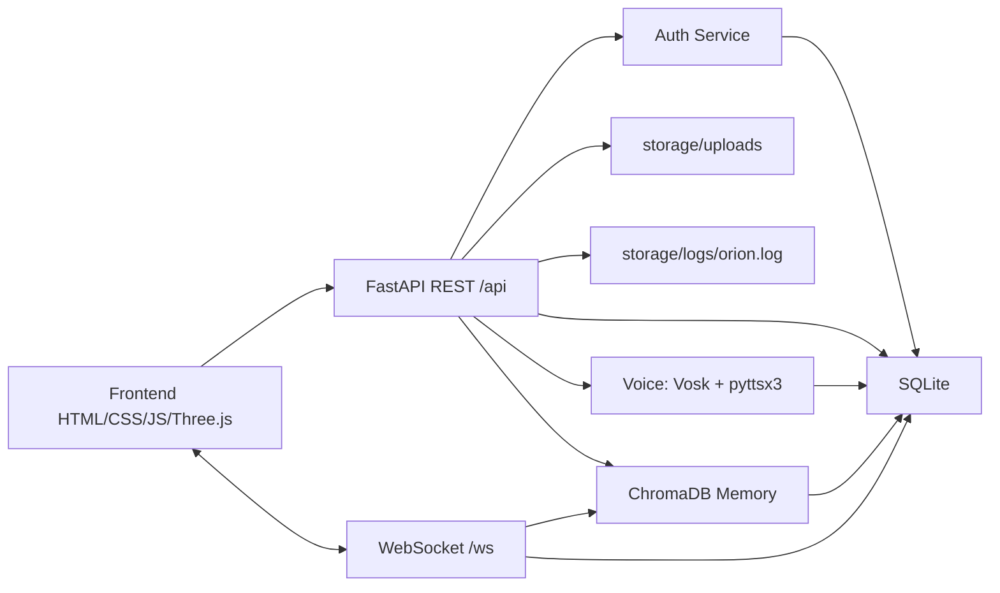

# Orion

## CI/CD

A fundacao possui pipeline automatizada para lint, testes, seguranca e build em cada alteracao.

No Windows:

```powershell
powershell -ExecutionPolicy Bypass -File .\scripts\run_ci.ps1
```

Consulte `CI_CD.md`.

As jornadas E2E em navegador podem ser executadas separadamente:

```powershell
powershell -ExecutionPolicy Bypass -File .\scripts\run_e2e.ps1
```

## Brain Baseline

O nucleo local deterministico do Brain separa memoria, planejamento, execucao,
aprendizado e conhecimento. Ele nao chama modelos externos nem executa acoes no host.

Consulte `BRAIN.md`.

## Model Runtime

A fundacao declara adapters para Ollama, LM Studio e APIs OpenAI compativeis, alem de
um ponto de extensao para providers futuros. O catalogo e somente leitura: nenhum
provider, modelo ou fallback remoto vem habilitado por padrao.

Consulte `MODEL_ARCHITECTURE.md`.

## Plataformas

Web/PWA e a interface compartilhada. Linux e macOS entram como hosts desktop
planejados; Android e iOS entram primeiro como clientes companion Capacitor.

Consulte `PLATFORM_ARCHITECTURE.md`.

## Design System

A PWA usa tokens semanticos, componentes compartilhados e temas `dark`, `light` e
`high-contrast`. A fundacao inclui foco visivel, skip link, reducao de movimento e
perfil idoso ampliado.

Consulte `DESIGN_SYSTEM.md`.

## Modo Cerebro 3D

O Modo Cerebro da PWA possui um nucleo neural premium com Three.js, particulas,
conexoes energeticas, nos de memoria e estados cognitivos para pensar, aprender,
pesquisar, lembrar e analisar arquivos. O modulo tenta usar WebGL com Bloom e
mantem fallback canvas/CSS para celular, PWA offline ou navegadores sem suporte.

As dependencias npm registram o ecossistema visual 3D solicitado, mas o deploy
principal continua FastAPI servindo frontend estatico.

## Voz Avancada e Pesquisa Web

A PWA possui `voice-engine.js`, que escolhe automaticamente a melhor voz disponivel.
Quando Azure Speech, ElevenLabs, OpenAI TTS ou Coqui TTS local nao estiverem
configurados, o Orion usa SpeechSynthesis API com voz `pt-BR`, pausas e variacao
leve de entonacao. Os modos disponiveis sao `conversation`, `teacher`,
`assistant` e `narrator`.

O modulo `orion_web_search` permite pesquisa integrada sem abrir Google
manualmente. O frontend pede confirmacao antes de qualquer consulta externa,
envia somente a pergunta sanitizada, bloqueia padroes sensiveis e mostra fontes
no chat quando a internet responde.

## Arquivos, Camera e Analise Local

O modulo `orion_files` adiciona armazenamento de arquivos por usuario, captura de
foto pelo navegador e analise basica offline. Os arquivos ficam fora do frontend
publico em `storage/files`, usam nome interno seguro e nunca sao executados.

Endpoints principais:

- `POST /api/files/upload`
- `GET /api/files?user_id=<id>`
- `GET /api/files/{id}?user_id=<id>`
- `DELETE /api/files/{id}?user_id=<id>`
- `POST /api/files/{id}/analyze`
- `POST /api/camera/photo`

O sistema aceita imagens, PDFs, textos, documentos e planilhas permitidos pela
allowlist. Textos sao resumidos localmente; PDFs com texto usam `pypdf`; imagens
recebem metadados basicos e mensagem clara quando OCR nao estiver configurado.
Visitantes e usuarios so acessam arquivos associados ao seu `userId` local.

## Onboarding

Na primeira execucao, a PWA solicita nome, preferencias, perfil, voz e aparencia. Os
dados sao persistidos localmente com AES-256-GCM e nao entram no cache offline.

Consulte `ONBOARDING.md`.

## Wiki Interna

APIs, tabelas SQLite, contrato de plugins e eventos compartilhados sao documentados
automaticamente em `docs/wiki`. O gerador nao le valores do banco local.

```powershell
python scripts/generate_wiki.py
python scripts/generate_wiki.py --check
```

Consulte `WIKI.md`.

## Changelog Automatico

Alteracoes relevantes entram como fragmentos JSON pequenos e geram `CHANGELOG.md`.
A CI bloqueia divergencias e o build regenera o arquivo antes do pacote.

```powershell
python scripts/generate_changelog.py --new added --summary "Nova capacidade local"
python scripts/generate_changelog.py --check
```

Consulte `CHANGELOG_SYSTEM.md`.

Backend principal do Orion com FastAPI, SQLite, WebSocket, API REST, usuarios, login convidado, login administrador, uploads, logs, sistema de voz offline e memoria semantica.

## Tecnologias

- Python
- FastAPI
- SQLite
- WebSocket
- HTML
- CSS
- JavaScript
- Three.js
- Vosk
- pyttsx3
- ChromaDB

## Estrutura

```text
orion/
  app/
    api/
      auth.py
      dependencies.py
      logs.py
      memory.py
      routes.py
      uploads.py
      users.py
      voice.py
    auth/
      security.py
      service.py
    core/
      config.py
      logging.py
      time.py
    db/
      connection.py
      init_db.py
      repositories.py
    models/
      auth.py
      common.py
      logs.py
      memory.py
      uploads.py
      users.py
    uploads/
      service.py
    memory/
      chroma_store.py
      embeddings.py
      service.py
      summarizer.py
    voice/
      listener.py
      recognizer.py
      service.py
      settings.py
      tts.py
      wake_word.py
    websockets/
      manager.py
      routes.py
    main.py
  database/
    schema.sql
    seed.sql
  frontend/
    index.html
    assets/
      css/styles.css
      js/api.js
      js/main.js
      js/socket.js
  scripts/
    run_dev.ps1
    run_voice_listener.ps1
  models/
    vosk/
  storage/
    chroma/
    logs/
    uploads/
  .env.example
  requirements.txt
```

## Configuracao

Copie `.env.example` para `.env` quando quiser customizar o ambiente.

Variaveis principais:

- `DATABASE_URL`: caminho SQLite. Padrao: `sqlite:///./database/orion.db`
- `UPLOAD_DIR`: destino dos uploads. Padrao: `storage/uploads`
- `LOG_DIR`: destino dos logs. Padrao: `storage/logs`
- `MODEL_SELECTION_MODE`: politica de selecao. Padrao: `explicit-only`
- `MODEL_EXTERNAL_CALLS_ENABLED`: opt-in para providers remotos. Padrao: `false`
- `MODEL_REMOTE_HOST_ALLOWLIST`: hosts remotos explicitamente permitidos. Padrao: `[]`
- `OLLAMA_BASE_URL`: endpoint local Ollama. Padrao: `http://127.0.0.1:11434`
- `LM_STUDIO_BASE_URL`: endpoint local LM Studio. Padrao: `http://127.0.0.1:1234/v1`
- `OPENAI_COMPATIBLE_BASE_URL`: endpoint HTTPS remoto opcional
- `OPENAI_COMPATIBLE_API_KEY_REF`: referencia logica futura do Vault, nunca a chave real
- `AZURE_SPEECH_KEY_REF`: referencia segura para credencial Azure Speech, nunca a chave real
- `AZURE_SPEECH_REGION`: regiao Azure Speech quando configurada pelo administrador
- `ELEVENLABS_API_KEY_REF`: referencia segura para credencial ElevenLabs
- `OPENAI_TTS_API_KEY_REF`: referencia segura para credencial OpenAI TTS
- `COQUI_TTS_MODEL_PATH`: caminho local opcional para modelos Coqui TTS
- `WEB_SEARCH_ENABLED`: habilita o modulo de pesquisa integrada. Padrao: `true`
- `WEB_SEARCH_PROVIDER`: provedor de pesquisa. Padrao: `duckduckgo-html+mojeek`
- `WEB_SEARCH_TIMEOUT_SECONDS`: tempo maximo por consulta web
- `WEB_SEARCH_MAX_RESULTS`: limite de fontes retornadas por consulta
- `FILE_STORAGE_BACKEND`: backend de arquivos. Padrao: `local`
- `FILE_STORAGE_PATH`: diretorio seguro dos arquivos. Padrao: `storage/files`
- `FILE_UPLOAD_MAX_BYTES`: limite por arquivo. Padrao: `15728640`
- `FILE_ALLOWED_EXTENSIONS`: allowlist de extensoes aceitas
- `FILE_BLOCKED_EXTENSIONS`: extensoes ativas bloqueadas por seguranca
- `ADMIN_USERNAME`: usuario admin inicial. Padrao: `admin`
- `ADMIN_PASSWORD`: segredo local injetado por ambiente durante desenvolvimento. Nunca versionar.
- `SESSION_EXPIRE_HOURS`: validade do token de sessao.
- `VOICE_WAKE_WORD`: palavra de ativacao. Padrao: `orion`
- `VOICE_MODEL_DIR`: caminho do modelo Vosk offline. Padrao: `models/vosk`
- `VOICE_SAMPLE_RATE`: taxa de audio do reconhecimento.
- `VOICE_TTS_RATE`: velocidade da voz sintetizada.
- `VOICE_TTS_VOLUME`: volume do TTS entre `0.0` e `1.0`.
- `MEMORY_DIR`: diretorio persistente do ChromaDB. Padrao: `storage/chroma`
- `MEMORY_SHORT_LIMIT`: limite operacional da memoria curta.
- `MEMORY_SEARCH_RESULTS`: quantidade padrao de resultados semanticos.
- `ONBOARDING_CRYPTO_PATH`: chave bootstrap local do onboarding. Padrao: `storage/keys/onboarding.key`

## Execucao

```powershell
python -m venv .venv
.\.venv\Scripts\Activate.ps1
pip install -r requirements.txt
.\scripts\run_dev.ps1
```

A aplicacao fica disponivel em:

```text
http://127.0.0.1:8000
```

## Acesso Publico Opcional

O Orion pode ser disponibilizado temporariamente por um link HTTPS seguro usando Cloudflare Tunnel, sem alterar a arquitetura, o backend, o frontend, o WebSocket ou o PWA.

Resumo:

```powershell
powershell -ExecutionPolicy Bypass -File .\scripts\run_persistent.ps1
.\start_public_tunnel.bat
```

Compartilhe o link gerado somente com pessoas autorizadas. Visitantes nunca devem receber acesso administrativo.

Consulte `docs/PUBLIC_ACCESS.md`.

## GitHub E Deploy 24/7

GitHub deve ser usado para versionar o codigo do Orion. Ele nao hospeda backend Python com WebSocket 24/7 sozinho.

Para deixar o Orion online mesmo com o PC desligado, publique em uma hospedagem cloud como Render, Railway, Fly.io, VPS Linux ou Docker em servidor cloud.

Guias:

- `docs/GITHUB_SETUP.md`: salvar o projeto no GitHub.
- `docs/DEPLOY_24_7.md`: opcoes para deixar Orion online 24/7.
- `docs/PUBLIC_HOSTING.md`: caminhos de hospedagem publica.
- `docs/SECURITY_PUBLIC_RELEASE.md`: checklist de seguranca antes de publicar.

Arquivos de deploy:

- `Dockerfile`
- `docker-compose.yml`

Antes de publicar, confirme que `.env`, bancos reais, uploads, chaves, tokens, logs sensiveis e modelos grandes privados nao estao no Git.

## Banco de Dados

O banco e inicializado no startup da aplicacao.

Tabelas:

- `system_metadata`: metadados tecnicos do projeto.
- `users`: usuarios convidados e administradores.
- `sessions`: tokens de sessao.
- `uploads`: metadados de arquivos enviados.
- `app_logs`: logs persistidos pela API.
- `voice_settings`: configuracoes de voz.
- `voice_events`: transcricoes, ativacoes e respostas por voz.
- `user_preferences`: preferencias persistentes por usuario.
- `memory_summaries`: resumos gerados a partir da memoria.
- `websocket_events`: eventos recebidos por WebSocket.
- `orion_files`: metadados e analises de arquivos por usuario.

O usuario administrador inicial e criado automaticamente se nao existir.

## API REST

Base URL:

```text
/api
```

Endpoints publicos:

- `GET /api/health`
- `GET /api/models`
- `GET /api/models/status`
- `GET /api/onboarding/status`
- `POST /api/auth/guest`
- `POST /api/auth/admin`

Endpoint bootstrap protegido por origem local permitida:

- `POST /api/onboarding/complete`

Endpoints autenticados:

- `GET /api/auth/me`
- `POST /api/auth/logout`
- `POST /api/uploads`
- `POST /api/logs`
- `GET /api/voice/status`
- `GET /api/voice/settings`
- `POST /api/voice/text`
- `POST /api/voice/speak`
- `POST /api/voice/recognize`
- `GET /api/memory/status`
- `POST /api/memory`
- `POST /api/memory/search`
- `GET /api/memory/preferences`
- `PUT /api/memory/preferences`
- `POST /api/memory/summaries`
- `GET /api/memory/summaries`
- `GET /api/files/status`
- `POST /api/files/upload`
- `GET /api/files`
- `GET /api/files/{id}`
- `DELETE /api/files/{id}`
- `POST /api/files/{id}/analyze`
- `POST /api/camera/photo`

Endpoints administrativos:

- `GET /api/users`
- `GET /api/uploads`
- `GET /api/logs`
- `PUT /api/voice/settings`
- `GET /api/voice/events`

Use o token retornado no login:

```text
Authorization: Bearer <token>
```

## Login Convidado

```http
POST /api/auth/guest
Content-Type: application/json

{
  "display_name": "Visitante"
}
```

## Login Administrador

```http
POST /api/auth/admin
Content-Type: application/json

{
  "username": "admin",
  "password": "<configured-admin-password>"
}
```

Nenhuma credencial administrativa padrao e permitida. Consulte `SECRETS_POLICY.md`.

## Uploads

```http
POST /api/uploads
Authorization: Bearer <token>
Content-Type: multipart/form-data
```

Campo:

```text
file
```

Os arquivos sao salvos em `storage/uploads` e seus metadados ficam em `uploads`.

## Logs

```http
POST /api/logs
Authorization: Bearer <token>
Content-Type: application/json

{
  "level": "info",
  "message": "Evento registrado",
  "context": {
    "module": "frontend"
  }
}
```

Logs tambem sao gravados em arquivo em `storage/logs/orion.log`.

## Voz Offline

O Orion usa Vosk para reconhecimento offline e `pyttsx3` para resposta por voz.

### Modelo Vosk

Baixe um modelo Vosk compatível com o idioma desejado e coloque seu conteudo em:

```text
models/vosk/
```

O diretorio deve conter os arquivos do modelo, como `am`, `conf`, `graph` e outros arquivos fornecidos pelo Vosk. Os arquivos reais do modelo nao sao versionados pelo git.

### Palavra de Ativacao

A palavra padrao e:

```text
orion
```

Quando uma transcricao contem a palavra de ativacao, o Orion gera uma resposta e pode falar usando `pyttsx3`.

### Endpoints de Voz

Processar texto como se fosse uma transcricao:

```http
POST /api/voice/text
Authorization: Bearer <token>
Content-Type: application/json

{
  "text": "orion status do sistema",
  "speak": true
}
```

Enviar audio WAV para reconhecimento offline:

```http
POST /api/voice/recognize
Authorization: Bearer <token>
Content-Type: multipart/form-data
```

Campo:

```text
file
```

Falar um texto:

```http
POST /api/voice/speak
Authorization: Bearer <token>
Content-Type: application/json

{
  "text": "Orion online."
}
```

Atualizar configuracoes de voz requer administrador:

```http
PUT /api/voice/settings
Authorization: Bearer <admin-token>
Content-Type: application/json

{
  "wake_word": "orion",
  "enabled": true,
  "tts_enabled": true,
  "tts_rate": 175,
  "tts_volume": 1.0
}
```

### Listener Local de Microfone

Para escuta continua offline com microfone:

```powershell
.\scripts\run_voice_listener.ps1
```

Esse processo fica separado do servidor web. Ele usa `sounddevice` para capturar audio local, Vosk para transcrever offline e `pyttsx3` para responder quando ouvir a palavra de ativacao.

## Memoria Semantica

O Orion usa ChromaDB como banco vetorial persistente em:

```text
storage/chroma/
```

Colecoes:

- `orion_short_memory`: mensagens recentes, eventos de conversa e contexto temporario.
- `orion_long_memory`: preferencias, resumos e fatos duradouros.

Os embeddings sao gerados localmente por uma funcao deterministica de tokens e n-gramas. Isso mantem a busca semantica local e sem servico externo.

### Criar Memoria

```http
POST /api/memory
Authorization: Bearer <token>
Content-Type: application/json

{
  "content": "O usuario prefere respostas objetivas.",
  "memory_type": "long",
  "source": "manual"
}
```

### Busca Semantica

```http
POST /api/memory/search
Authorization: Bearer <token>
Content-Type: application/json

{
  "query": "como devo responder ao usuario?",
  "memory_type": "all",
  "limit": 5
}
```

### Preferencias do Usuario

```http
PUT /api/memory/preferences
Authorization: Bearer <token>
Content-Type: application/json

{
  "key": "tom",
  "value": "direto e colaborativo"
}
```

Preferencias tambem sao gravadas na memoria longa para busca semantica.

### Resumos

```http
POST /api/memory/summaries
Authorization: Bearer <token>
Content-Type: application/json

{
  "scope": "short",
  "limit": 20
}
```

O resumo e persistido no SQLite e tambem indexado na memoria longa.

## WebSocket

Endpoint:

```text
/ws
```

Com autenticacao opcional:

```text
/ws?token=<token>
```

Fluxo:

1. Cliente conecta em `/ws`.
2. Backend aceita a conexao.
3. Backend envia `system.ready`.
4. Cliente envia texto ou JSON serializado.
5. Backend registra em `websocket_events`.
6. Backend transmite a mensagem para conexoes ativas.

Evento inicial:

```json
{
  "type": "system.ready",
  "payload": {
    "message": "Orion WebSocket connected",
    "authenticated": true
  }
}
```

## Fluxo Geral



## Observacoes de Seguranca

- A autenticacao usa tokens de sessao guardados no SQLite.
- Senhas sao armazenadas com PBKDF2 SHA-256 e salt.
- O usuario admin padrao existe apenas para desenvolvimento.
- SQLite e adequado para a fundacao local; para producao, planeje migracoes e politicas de backup.
