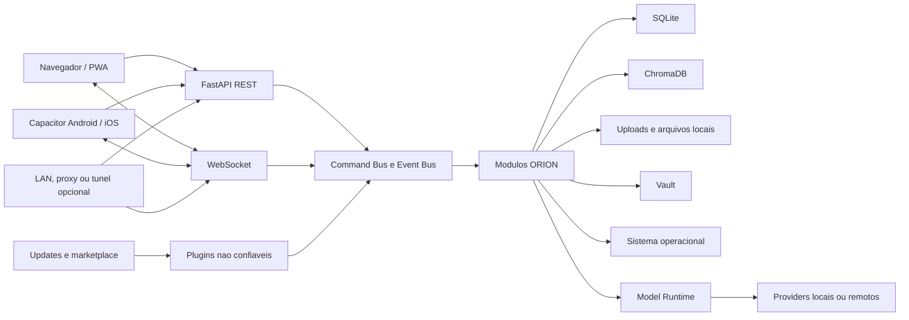

# ORION Threat Model

## Documento

| Campo | Valor |
| --- | --- |
| Sistema | ORION |
| Versao do modelo | 1.6 |
| Data da revisao | 2026-06-22 |
| Metodo | STRIDE com analise por superficie |
| Escopo | Fundacao atual e arquitetura-alvo documentada |
| Responsavel | Arquitetura e seguranca do ORION |

Este documento deve evoluir junto com o sistema. Cada ticket que altera entrada externa,
permissoes, armazenamento, rede, plugins, atualizacao ou controle do host deve revisar
as ameacas relacionadas antes de ser aprovado.

## Objetivo

Identificar como um invasor pode comprometer confidencialidade, integridade,
disponibilidade ou rastreabilidade do ORION e transformar cada risco relevante em
controle verificavel.

O modelo segue as quatro perguntas recomendadas pela OWASP:

1. O que esta sendo construido?
2. O que pode dar errado?
3. O que sera feito a respeito?
4. A mitigacao foi suficiente?

## Estado Atual

A fundacao executavel possui:

- FastAPI local;
- PWA estatica;
- SQLite para metadados e eventos;
- `GET /api/health`;
- `GET /api/status`;
- `GET /api/brain/status`;
- `POST /api/brain/process` em modo local deterministico sem efeitos colaterais;
- `GET /api/tools` para catalogo local de ferramentas;
- `GET /api/models` para catalogo sanitizado de providers desabilitados;
- `GET /api/onboarding/status`, `POST /api/onboarding/complete`, `GET /api/onboarding/profile` e `PUT /api/onboarding/profile` para configuracao inicial local;
- `GET /api/files/status`, `POST /api/files/upload`, `GET /api/files`, `GET /api/files/{id}`, `DELETE /api/files/{id}` e `POST /api/files/{id}/analyze`;
- `POST /api/camera/photo` para fotos capturadas pelo navegador;
- WebSocket `/ws` para mensagens basicas;
- Wiki interna gerada para APIs, schema SQLite, plugins e eventos;
- changelog automatico gerado a partir de fragmentos estruturados;
- Release Candidate com manifesto, checksum SHA-256 e status de promocao;
- gate de prontidao para distribuicao 1.0 bloqueante;
- testes automatizados e CI/CD.

Ainda nao existem no backend principal:

- autenticacao e permissoes robustas por role;
- plugins instalaveis;
- controle do PC;
- acesso remoto aprovado.

Os cenarios em `tests/e2e` sao isolados e mantidos somente em memoria. Eles nao
representam funcionalidades de producao.

### Restricao Operacional Da Fundacao

Enquanto os controles deste documento nao forem implementados:

- executar somente em `127.0.0.1`;
- nao publicar em LAN, Cloudflare Tunnel ou internet;
- nao transmitir dados pessoais ou segredos pelo WebSocket;
- nao enviar dados pessoais ou segredos ao Brain baseline;
- nao habilitar providers de modelo nem enviar prompts para fora do processo;
- nao conectar cliente Web, Android ou iOS fora do host sem pareamento seguro;
- nao carregar plugins;
- nao tratar a fundacao como ambiente de producao.

## Metodo STRIDE

| Categoria | Propriedade protegida | Exemplo no ORION |
| --- | --- | --- |
| Spoofing | autenticidade | invasor se apresenta como administrador |
| Tampering | integridade | plugin altera arquivos ou banco |
| Repudiation | rastreabilidade | acao sensivel ocorre sem auditoria |
| Information disclosure | confidencialidade | segredo aparece em log ou broadcast |
| Denial of service | disponibilidade | flood WebSocket esgota memoria |
| Elevation of privilege | autorizacao | convidado dispara controle do PC |

## Classificacao

| Nivel | Criterio |
| --- | --- |
| Critico | pode executar codigo, controlar o host ou expor dados sensiveis em escala |
| Alto | compromete dados, sessoes ou disponibilidade com impacto relevante |
| Medio | impacto limitado, exige pre-condicao forte ou possui recuperacao simples |
| Baixo | impacto reduzido e facilmente detectavel ou reversivel |

Nenhuma funcionalidade pode ser exposta fora de `localhost` com ameaca critica aberta.

## Ativos Protegidos

| ID | Ativo | Sensibilidade |
| --- | --- | --- |
| A01 | chaves, tokens e senhas do Vault | critica |
| A02 | identidade, roles, sessoes e preferencias | alta |
| A03 | banco SQLite e migrations | alta |
| A04 | memoria ChromaDB, conversas e resumos | alta |
| A05 | uploads, documentos, musica e exports | alta |
| A06 | logs, metricas e trilha de auditoria | alta |
| A07 | permissoes de controle do PC | critica |
| A08 | plugins, manifestos e trust store | critica |
| A09 | pacotes de atualizacao e backups | critica |
| A10 | disponibilidade de CPU, RAM, disco e rede local | alta |
| A11 | camera, microfone e voz multiplayer | alta |
| A12 | prompts, respostas, modelos e credenciais de providers de IA | alta |
| A13 | nome, preferencias e credencial administrativa criptografadas do onboarding | alta |
| A14 | contratos e inventario seguro publicados pela Wiki interna | media |
| A15 | changelog e metadados de release publicados | media |
| A16 | artefatos, manifestos, checksums e relatorios de Release Candidate | critica |

## Atores Adversarios

| ID | Ator | Capacidade considerada |
| --- | --- | --- |
| AT01 | usuario local sem privilegio | acessa o mesmo computador e arquivos permitidos pelo SO |
| AT02 | processo local malicioso | tenta ler memoria, tokens, banco, logs ou alterar arquivos |
| AT03 | site malicioso aberto no navegador | tenta chamar REST local ou sequestrar WebSocket local |
| AT04 | dispositivo hostil na LAN | descobre portas, tenta login, flood e escuta trafego sem TLS |
| AT05 | atacante remoto | alcanca o ORION quando houver bind externo, proxy ou tunel |
| AT06 | autor de plugin malicioso | fornece pacote assinado indevidamente ou explora permissao excessiva |
| AT07 | dependencia comprometida | injeta codigo por pacote, update ou cadeia de fornecimento |
| AT08 | usuario autorizado abusivo | usa uma permissao legitima fora da intencao esperada |

## Fronteiras De Confianca

Fronteiras que exigem validacao:

1. navegador ou mobile para REST;
2. navegador ou mobile para WebSocket;
3. rede externa para processo local;
4. arquivo enviado para armazenamento e parsers;
5. plugin para Core e sistema operacional;
6. pacote externo para update ou marketplace;
7. Core para operacoes privilegiadas do host.
8. Model Runtime para processos locais ou endpoints remotos de IA.

## Ataques Locais

Local-first reduz exposicao de rede, mas nao torna o computador confiavel.

| ID | Ameaca | STRIDE | Nivel | Controles obrigatorios | Validacao |
| --- | --- | --- | --- | --- | --- |
| L01 | outro usuario local le SQLite, ChromaDB, uploads, backups ou logs | Information disclosure | Alto | ACL do SO, diretorios privados, Vault para segredos, redacao de logs | teste de permissoes e busca de segredos |
| L02 | site malicioso aberto no mesmo navegador conecta ao servico em `localhost` | Spoofing, elevation of privilege | Critico | auth em REST e WS, allowlist exata de `Origin`, CSRF quando aplicavel | conexao cross-origin deve falhar |
| L03 | processo local altera plugin, modelo, configuracao ou pacote de update | Tampering | Critico | assinatura, hash, trust store protegido, verificacao antes de carregar | alterar um byte deve bloquear carga |
| L04 | usuario ou processo dispara abrir programa, desligar ou reiniciar | Elevation of privilege | Critico | role admin, allowlist, parser estrito, confirmacao explicita e auditoria | testar negacao, confirmacao e trilha |
| L05 | processo ou usuario preenche disco, CPU ou RAM | Denial of service | Alto | quotas, limites de upload, jobs cancelaveis, monitoramento e backpressure | testes de limite e recuperacao |
| L06 | segredo aparece em `.env`, export, log ou backup sem protecao | Information disclosure | Critico | Vault AES-256-GCM, redacao centralizada, backup criptografado | secret scan e restore auditado |
| L07 | PWA ou service worker antigo preserva conteudo sensivel | Information disclosure | Medio | cache versionado, exclusao de respostas sensiveis, limpeza em logout | auditoria offline e troca de usuario |

## Ataques Remotos

O acesso remoto e opcional e deve permanecer desabilitado por padrao.

| ID | Ameaca | STRIDE | Nivel | Controles obrigatorios | Validacao |
| --- | --- | --- | --- | --- | --- |
| R01 | processo escuta em `0.0.0.0` ou tunel publica a fundacao sem endurecimento | Information disclosure, elevation of privilege | Critico | bind loopback por padrao, modo remoto explicito, preflight de seguranca | inicializacao remota deve falhar sem configuracao |
| R02 | atacante intercepta dados em LAN ou internet | Information disclosure, tampering | Critico | HTTPS e WSS, certificado valido, proxy documentado | rejeitar HTTP remoto e validar TLS |
| R03 | brute force, roubo ou replay de sessao | Spoofing | Alto | JWT curto, refresh controlado, revogacao, rate limit, nonce quando necessario | testes de expiracao, revogacao e limite |
| R04 | origem web nao autorizada chama REST local | Spoofing, elevation of privilege | Alto | CORS restrito, validacao de origem, CSRF para sessao baseada em cookie | chamadas de origem hostil devem falhar |
| R05 | endpoint administrativo fica acessivel remotamente | Elevation of privilege | Critico | role admin, step-up auth, confirmacao e auditoria | matriz de permissoes por endpoint |
| R06 | dependencia, update ou marketplace entrega pacote comprometido | Tampering | Critico | assinatura, checksum, staging, SBOM, backup e rollback | teste de pacote adulterado |
| R07 | erros ou metricas enviam dados sem autorizacao | Information disclosure | Alto | telemetria somente local por padrao, opt-in granular e redacao | teste offline e inspecao de rede |

## Uploads

Uploads devem ser considerados hostis mesmo quando enviados por administrador.

| ID | Ameaca | STRIDE | Nivel | Controles obrigatorios | Validacao |
| --- | --- | --- | --- | --- | --- |
| U01 | nome usa `../`, caminho absoluto, ADS ou nome reservado do Windows | Tampering | Alto | gerar ID interno, normalizar, ignorar nome como caminho e armazenar fora do webroot | corpus de traversal e nomes Windows |
| U02 | extensao ou MIME falso aciona parser vulneravel | Tampering, elevation of privilege | Critico | allowlist, assinatura de arquivo, parser isolado e dependencias atualizadas | fixtures com MIME e magic bytes divergentes |
| U03 | ZIP bomb, PDF malicioso ou arquivo enorme esgota recursos | Denial of service | Alto | limite por arquivo, quota por usuario, timeout e limite de descompressao | testar limites de tamanho e expansao |
| U04 | HTML, SVG ou documento ativo executa script ao ser exibido | Information disclosure, elevation of privilege | Alto | download como attachment, CSP, sanitizacao e tipos ativos bloqueados | corpus XSS e headers de resposta |
| U05 | arquivo sobrescreve dado existente | Tampering | Alto | nome interno aleatorio, escrita atomica e proibicao de overwrite silencioso | upload repetido preserva integridade |
| U06 | OCR, Vision ou Knowledge indexa documento sensivel indevidamente | Information disclosure | Alto | autorizacao por dono, consentimento, classificacao e exclusao propagada | teste de isolamento entre usuarios |
| U07 | malware fica disponivel para download local | Tampering | Alto | quarentena, scanner opcional local, auditoria e promocao explicita | arquivo em quarentena nao pode ser servido |

Controles de extensao, MIME e assinatura devem ser combinados. Nenhum deles e
suficiente isoladamente.

### Implementacao Atual De Arquivos

O modulo inicial `app/orion_files` reduz riscos imediatos de upload:

- armazena arquivos fora do frontend publico em `storage/files`;
- usa ID interno e nome sanitizado;
- bloqueia extensoes ativas como `.exe`, `.bat`, `.ps1`, `.js`, `.html` e `.svg`;
- limita tamanho por `FILE_UPLOAD_MAX_BYTES`;
- amarra metadados a `user_id` local e rejeita acesso a registros de outro usuario;
- nao executa arquivos enviados;
- oferece analise local limitada e OCR opcional.

Lacunas ainda abertas antes de exposicao publica ampla:

- `user_id` local nao substitui autenticacao forte;
- magic bytes e antivirus local ainda nao foram implementados;
- quotas por usuario e rate limit ainda precisam ser adicionados;
- parsers avancados/OCR devem rodar com timeout e isolamento quando forem habilitados.

## WebSockets

WebSocket e uma fronteira externa persistente. CORS nao substitui a validacao de
`Origin` durante o handshake.

| ID | Ameaca | STRIDE | Nivel | Controles obrigatorios | Validacao |
| --- | --- | --- | --- | --- | --- |
| W01 | cliente conecta sem identidade e recebe broadcasts | Spoofing, information disclosure | Critico | autenticar handshake, namespace por sessao e autorizacao por mensagem | conexao anonima deve falhar |
| W02 | site malicioso abre socket para `localhost` | Spoofing | Critico | allowlist exata de `Origin`, token ou cookie seguro e protecao CSWSH | origem nao permitida deve falhar |
| W03 | mensagens grandes, flood ou conexoes ociosas esgotam recursos | Denial of service | Alto | limite de payload, rate limit, limite de conexao, timeout, heartbeat e backpressure | flood, payload grande e idle timeout |
| W04 | payload malformado injeta XSS, SQL ou comando | Tampering, elevation of privilege | Alto | schemas versionados, allowlist de eventos e validacao antes do bus | corpus de payloads invalidos |
| W05 | mensagem sensivel completa e persistida em auditoria | Information disclosure | Alto | metadados minimos, redacao e classificacao de eventos | teste de ausencia de segredo no log |
| W06 | logout ou revogacao nao encerra socket antigo | Spoofing | Alto | revalidar sessao, fechar conexao revogada e expirar socket | revogar token encerra conexao |
| W07 | broadcast cru mistura usuarios ou salas multiplayer | Information disclosure | Critico | roteamento por usuario, sala e permissao; isolamento por sessao | dois usuarios nao recebem evento alheio |

### Lacunas Observadas Na Fundacao

A implementacao atual em `app/websockets/routes.py`:

- aceita conexao sem autenticacao;
- nao valida `Origin`;
- aceita texto livre sem schema;
- nao limita tamanho ou frequencia;
- retransmite cada mensagem para todas as conexoes;
- persiste o payload recebido em `websocket_events`.

Essas lacunas sao conhecidas e bloqueiam exposicao fora de `localhost`. O endurecimento
deve ocorrer em `T0007` e ser auditado novamente em `T0045`.

## Modelos De IA

Providers locais e remotos sao fronteiras nao confiaveis. Um endpoint OpenAI
compativel configuravel nao pode se tornar um canal implicito de saida de dados.

| ID | Ameaca | STRIDE | Nivel | Controles obrigatorios | Validacao |
| --- | --- | --- | --- | --- | --- |
| M01 | falha local troca silenciosamente para provider remoto | Information disclosure | Critico | selecao explicita e proibicao de fallback remoto automatico | indisponibilidade local nao gera trafego remoto |
| M02 | URL configurada aponta para host interno ou destino malicioso | Information disclosure, tampering | Alto | loopback estrito para local; HTTPS, allowlist e consentimento para remoto | corpus de URL e host fora da allowlist |
| M03 | credencial de API aparece em `.env`, catalogo ou log | Information disclosure | Critico | referencia logica de Vault, redacao e catalogo sanitizado | secret scan e resposta REST sem credencial |
| M04 | prompt contem segredo ou dado pessoal sem autorizacao | Information disclosure | Alto | classificacao, consentimento granular, redacao e auditoria por metadados | prompts sensiveis devem ser bloqueados |
| M05 | resposta maliciosa induz execucao de ferramenta privilegiada | Elevation of privilege | Critico | modelo nao executa acao; Tool System valida schema, permissao e confirmacao | resposta textual nao contorna registry |
| M06 | modelo, endpoint ou streaming esgota CPU, RAM ou conexoes | Denial of service | Alto | timeout, cancelamento, limite de tokens, circuit breaker e concorrencia limitada | testes de timeout e cancelamento |
| M07 | download de modelo adulterado compromete host | Tampering | Critico | confirmacao admin, origem, checksum, assinatura quando disponivel e quarentena | artefato alterado deve ser rejeitado |

### Politica Inicial Para Modelos

1. Todos os providers permanecem desabilitados na fundacao.
2. Ollama e LM Studio aceitam somente loopback.
3. Provider remoto exige opt-in, consentimento, HTTPS e allowlist.
4. Segredo real nunca entra no catalogo; somente referencia futura de Vault.
5. Inferencia futura passa pela ferramenta registrada `models.generate`.
6. Nenhum download ou fallback remoto ocorre automaticamente.

## Onboarding

O onboarding e uma janela curta de bootstrap antes da camada de identidade. Ele recebe
dados pessoais e precisa permanecer restrito ao host local.

| ID | Ameaca | STRIDE | Nivel | Controles obrigatorios | Validacao |
| --- | --- | --- | --- | --- | --- |
| O01 | site hostil conclui onboarding em nome do usuario | Spoofing, tampering | Alto | bind loopback, CORS restrito, `Origin` local obrigatoria e conclusao unica | origem ausente ou hostil deve falhar |
| O02 | nome, preferencias ou senha administrativa aparecem em texto puro no SQLite | Information disclosure | Alto | AES-256-GCM, nonce unico, hash derivado da senha e teste negativo de plaintext | buscar nome e senha em bytes persistidos |
| O03 | adulteracao do ciphertext altera perfil silenciosamente | Tampering | Alto | tag GCM e erro sanitizado | alterar byte deve bloquear leitura |
| O04 | chave bootstrap entra no Git, release ou backup comum | Information disclosure | Critico | arquivo separado, ignore de Git, release sem chave e migracao para Vault | inspecao de artefato e secret scan |
| O05 | processo local conclui onboarding antes do usuario | Spoofing | Medio | operacao somente local, janela curta e futura migracao para bootstrap Identity | revisar em `T0009` e `T0039` |
| O06 | edicao posterior de perfil ocorre sem senha administrativa atual | Elevation of privilege | Alto | `PUT /profile` exige senha atual e compara hash por tempo constante | senha errada deve receber `403` |

### Limite Do Bootstrap

A chave local separada reduz exposicao do SQLite, mas nao equivale ao Vault. LAN,
tunel e internet permanecem bloqueados. `T0011` deve migrar a protecao da chave para o
mecanismo seguro do sistema operacional.

## Plugins

Plugins sao codigo nao confiavel. Uma permissao logica dentro do mesmo processo Python
nao constitui sandbox forte contra plugin hostil.

| ID | Ameaca | STRIDE | Nivel | Controles obrigatorios | Validacao |
| --- | --- | --- | --- | --- | --- |
| P01 | plugin executa codigo arbitrario com privilegio do ORION | Elevation of privilege | Critico | plugins desabilitados por padrao, processo isolado, IPC restrito e capability tokens | plugin tenta acessar recurso nao concedido |
| P02 | pacote ou manifesto e alterado apos aprovacao | Tampering | Critico | assinatura digital, checksum, trust store e verificacao em cada carga | alterar pacote bloqueia ativacao |
| P03 | update adiciona permissao sem nova confirmacao | Elevation of privilege | Critico | diff de permissoes, aprovacao admin e auditoria | update com permissao extra deve pausar |
| P04 | arquivo compactado escreve fora de staging | Tampering | Alto | extracao segura, caminho canonico, quota e staging descartavel | corpus Zip Slip e nomes reservados |
| P05 | hot reload deixa thread, socket ou handler antigo ativo | Tampering, denial of service | Alto | lifecycle transacional, timeout, cleanup e rollback | reload repetido sem duplicar recursos |
| P06 | plugin exfiltra memoria, arquivos, camera, microfone ou rede | Information disclosure | Critico | negar por padrao, processo isolado, grants granulares e telemetria local | matriz negativa de permissoes |
| P07 | dependencia transitiva comprometida entra no marketplace | Tampering | Alto | pinning, SBOM, auditoria, assinatura e politica de origem | pacote desconhecido deve ir para quarentena |
| P08 | plugin publica evento interno privilegiado diretamente | Elevation of privilege | Critico | gateway do bus, identidade do plugin e autorizacao por comando/evento | evento privilegiado sem grant deve falhar |

### Politica Inicial Para Plugins

1. Nenhum plugin e carregado antes de `T0033` e `T0034`.
2. Pacotes entram em `plugins/quarantine`.
3. Instalacao, update e remocao exigem administrador.
4. Qualquer permissao adicional exige nova aprovacao.
5. Plugin nao aprovado nunca compartilha o processo principal.
6. Hot reload falho restaura a versao anterior ou mantem o plugin desativado.

## Wiki Interna

A Wiki e empacotada com a fundacao e deve publicar apenas contratos tecnicos seguros.

| ID | Ameaca | STRIDE | Nivel | Controles obrigatorios | Validacao |
| --- | --- | --- | --- | --- | --- |
| WI01 | gerador inclui linhas do banco local, payloads, segredos ou metadados sensiveis de plugins | Information disclosure | Alto | SQLite em memoria, fontes declarativas, allowlist de campos de inventario e secret scan | teste de geracao e inspecao do pacote |
| WI02 | Wiki versionada diverge do contrato executavel e induz integracao incorreta | Tampering | Medio | geracao deterministica e `--check` na CI | alterar contrato sem regenerar deve falhar |

O gerador pode ler OpenAPI, schema SQL, migrations, JSON Schema de plugins e catalogo
de eventos. Ele nao pode abrir o banco local, `.env`, chaves, uploads ou payloads.

## Changelog

O changelog acompanha o pacote distribuido e deve conter somente informacao publica,
sanitizada e coerente com a release.

| ID | Ameaca | STRIDE | Nivel | Controles obrigatorios | Validacao |
| --- | --- | --- | --- | --- | --- |
| C01 | fragmento publica segredo, dado pessoal, caminho privado ou payload sensivel | Information disclosure | Alto | politica de segredos, revisao, schema estrito e secret scan | inspecao do pacote e scanner |
| C02 | changelog empacotado diverge dos fragmentos ou anuncia release inexistente | Tampering | Medio | geracao deterministica, registro de releases e `--check` na CI | testes de drift e versao desconhecida |

## Release Candidate

Um RC e parte da cadeia de fornecimento. Ele nao pode mascarar bloqueios criticos nem
permitir promocao operacional sem evidencia reproduzivel.

| ID | Ameaca | STRIDE | Nivel | Controles obrigatorios | Validacao |
| --- | --- | --- | --- | --- | --- |
| RC01 | candidato com bloqueios criticos e promovido como release utilizavel | Tampering, repudiation | Critico | status explicito, blockers obrigatorios, relatorio de auditoria e aprovacao administrativa | candidato bloqueado deve falhar criterio de promocao |
| RC02 | artefato empacotado diverge do manifesto ou checksum | Tampering | Critico | SHA-256, manifesto gerado no build e verificacao antes de distribuir | alterar um byte deve invalidar checksum |
| RC03 | auditoria ignora dependencias vulneraveis instaladas no ambiente de validacao | Information disclosure, tampering | Alto | auditoria runtime direta e auditoria local do ambiente | vulnerabilidade local deve bloquear promocao |
| RC04 | distribuicao 1.0 segue mesmo com RC bloqueado | Repudiation, tampering | Critico | readiness report bloqueante e falha explicita em `--fail-on-blocked` | script deve retornar status bloqueado |

## Controles Transversais

| Controle | Aplicacao |
| --- | --- |
| deny by default | roles, plugins, rede, arquivos, camera, microfone e host |
| menor privilegio | grants pequenos por usuario, plugin e comando |
| validacao de entrada | REST, WS, arquivos, QR Code, OCR, modelos e manifestos |
| redacao de logs | token, senha, conteudo pessoal e segredo nunca entram em log |
| criptografia | TLS em rede externa e AES-256-GCM para segredos em repouso |
| auditoria | login, negacao, upload, plugin, host, update, backup e restore |
| recuperacao | backup verificado antes de update e rollback testado |
| cadeia de fornecimento | pinning, auditoria, SBOM, assinatura e checksum |
| isolamento | parsers arriscados e plugins fora do processo principal |
| Tool System | toda acao registrada, validada, autorizada e auditavel |
| Model Runtime | selecao explicita, loopback local, HTTPS remoto, allowlist e Vault |
| Onboarding | AES-256-GCM, origem local obrigatoria e chave bootstrap separada |
| Wiki interna | fontes declarativas, schema SQLite em memoria, inventario allowlisted e drift check |
| Changelog | fragmentos sanitizados, schema estrito, releases registradas e drift check |
| Release Candidate | manifesto estrito, checksum SHA-256, status bloqueante, readiness report e relatorios persistentes |

## Plano De Tratamento

| Prioridade | Ameacas | Ticket principal | Gate |
| --- | --- | --- | --- |
| P0 | W01-W07, L02 | T0007 | nenhum acesso LAN ou remoto antes da mitigacao |
| P0 | R01-R05 | T0009, T0012 | acesso remoto permanece desabilitado |
| P0 | L04 | T0031 | Control nao existe sem confirmacao e auditoria |
| P0 | P01-P08 | T0033, T0034 | plugins permanecem desabilitados |
| P0 | U01-U07 | T0020 | modulo inicial ativo; falta autenticacao forte, magic bytes, quotas e rate limit |
| P1 | L01, L06 | T0011, T0012 | cofre e logs antes de dados sensiveis |
| P1 | R06 | T0036 | update somente apos assinatura, backup e rollback |
| P1 | R07 | T0037 | telemetria externa somente com opt-in |
| P1 | M01-M07 | T0011, T0012, T0017 | providers permanecem desabilitados ate integracao segura |
| P1 | O01-O06 | T0009, T0011, T0039 | onboarding permanece somente em loopback |
| P1 | RC01-RC04 | T0051, T0052 | candidato e distribuicao permanecem bloqueados ate auditoria limpa e aprovacao |
| P1 | auditoria ofensiva | T0045 | obrigatoria antes do release 1.0 |

## Criterios De Aceitacao De Seguranca

Antes de liberar rede local ou remota:

- autenticacao e autorizacao existem em REST e WebSocket;
- TLS e WSS sao obrigatorios fora de loopback;
- origens permitidas sao exatas e configuradas;
- rate limits e limites de payload possuem testes;
- logout e revogacao encerram sockets;
- logs nao persistem segredos ou payloads sensiveis completos;
- endpoints administrativos possuem matriz de permissao.

Antes de liberar uploads:

- traversal, overwrite, MIME spoofing, magic bytes e tamanho possuem testes;
- arquivo fica fora do webroot;
- nome interno e gerado pela aplicacao;
- quarentena e autorizacao por dono existem;
- parsers arriscados possuem timeout e isolamento.

Antes de liberar plugins:

- assinatura, checksum e trust store possuem testes negativos;
- pacote e extraido somente em staging;
- grants sao negados por padrao;
- permissao nova exige aprovacao administrativa;
- isolamento fora do processo principal esta definido;
- falha no hot reload possui rollback verificavel.

Antes de liberar modelos:

- provider local rejeita host fora de loopback;
- provider remoto exige HTTPS, opt-in, consentimento e allowlist;
- credencial real e resolvida somente pelo Vault;
- catalogo REST e logs nao expoem credencial nem prompt;
- fallback remoto automatico nao existe;
- timeout, cancelamento e limite de concorrencia possuem testes.

Antes de liberar onboarding fora de loopback:

- identidade administrativa protege bootstrap e leitura;
- chave bootstrap migrou para o Vault e mecanismo seguro do SO;
- auditoria registra conclusao sem payload pessoal;
- HTTPS e protecao CSRF foram validados.

## Casos De Teste Obrigatorios

| Suite | Casos minimos |
| --- | --- |
| local | arquivo de segredo em log, permissao de diretorio, cache apos logout |
| remoto | bind indevido, HTTP remoto, CORS hostil, JWT expirado e revogado |
| uploads | traversal, nome reservado Windows, MIME falso, magic bytes falsos, arquivo enorme, ZIP bomb e XSS |
| WebSocket | origem hostil, anonimo, token expirado, flood, payload grande, schema invalido e isolamento de sala |
| plugins | assinatura invalida, checksum divergente, Zip Slip, grant ausente, permissao nova e rollback de reload |
| modelos | loopback invalido, HTTP remoto, host fora da allowlist, credencial sanitizada, fallback remoto e timeout |
| onboarding | origem hostil, origem ausente, overwrite, plaintext no banco, senha errada e ciphertext adulterado |
| wiki | geracao deterministica, banco em memoria, inventario seguro e ausencia de segredos no pacote |
| changelog | drift, release desconhecida, schema invalido e ausencia de segredo no pacote |

## Evidencias E Revisao

Cada mitigacao deve produzir:

- teste automatizado;
- roteiro manual quando necessario;
- evento de auditoria verificavel;
- atualizacao deste documento;
- registro no `PROJECT_STATUS.md`.

Revisar obrigatoriamente quando:

- uma nova rota REST ou mensagem WebSocket for criada;
- LAN, proxy, HTTPS ou tunel forem habilitados;
- um novo tipo de arquivo ou parser for aceito;
- Plugin SDK, marketplace ou hot reload mudarem;
- Control ganhar um novo comando;
- provider, adapter, download ou politica de selecao de modelo mudar;
- coleta, persistencia ou exibicao de dado do onboarding mudar;
- uma nova fonte de dados ou campo de inventario entrar na Wiki;
- formato de changelog, metadado de release ou exibicao de update mudar;
- definicao, manifesto, checksum, artefato ou regra de promocao de Release Candidate mudar;
- update, backup, Vault ou telemetria mudarem;
- houver incidente ou dependencia vulneravel.

## Referencias

- [OWASP Threat Modeling Cheat Sheet](https://cheatsheetseries.owasp.org/cheatsheets/Threat_Modeling_Cheat_Sheet.html)
- [OWASP WebSocket Security Cheat Sheet](https://cheatsheetseries.owasp.org/cheatsheets/WebSocket_Security_Cheat_Sheet.html)
- [OWASP File Upload Cheat Sheet](https://cheatsheetseries.owasp.org/cheatsheets/File_Upload_Cheat_Sheet.html)
- [OWASP REST Security Cheat Sheet](https://cheatsheetseries.owasp.org/cheatsheets/REST_Security_Cheat_Sheet.html)
- [OWASP Software Supply Chain Security Cheat Sheet](https://cheatsheetseries.owasp.org/cheatsheets/Software_Supply_Chain_Security_Cheat_Sheet.html)
- [ORION Secrets Policy](SECRETS_POLICY.md)
- [NIST SP 800-218 SSDF](https://csrc.nist.gov/pubs/sp/800/218/final)
- [NIST SP 800-161 Rev. 1 C-SCRM](https://csrc.nist.gov/pubs/sp/800/161/r1/upd1/final)
