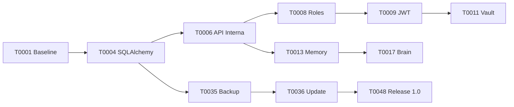

# ORION Execution Plan

## Premissas

- Estimativas representam trabalho de engenharia, revisao e testes.
- Uma pessoa experiente em tempo integral e a referencia.
- Recursos de IA, visao e mobile dependem de hardware e toolchains externos.
- O produto deve permanecer executavel ao final de cada marco.

## Ordem Ideal

| Ordem | Fase | Tickets | Estimativa |
| --- | --- | --- | --- |
| 1 | Governanca e baseline | T0001-T0003 | 1-2 semanas |
| 2 | Persistencia e API interna | T0004-T0007 | 2-3 semanas |
| 3 | Identidade e seguranca base | T0008-T0012 | 3-4 semanas |
| 4 | Memoria, voz e Brain | T0013-T0018 | 4-6 semanas |
| 5 | Produtividade e conteudo | T0019-T0026 | 6-9 semanas |
| 6 | Experiencia, Control e multiplayer | T0027-T0032 | 5-8 semanas |
| 7 | Plataforma e operacao | T0033-T0041 | 5-8 semanas |
| 8 | Qualidade e release | T0042-T0048 | 4-6 semanas |

Estimativa total inicial: 30-46 semanas para uma pessoa, dependendo de profundidade visual, suporte mobile, modelos locais e nivel de endurecimento de seguranca.

## Gates

| Gate | Condicao |
| --- | --- |
| G0 | arquitetura aprovada |
| G1 | fundacao backend/PWA executa localmente em instalacao limpa |
| G2 | banco, API interna e auth possuem testes |
| G3 | memoria, voz e Brain operam de forma degradavel |
| G4 | modulos principais usam somente API interna |
| G5 | backup e update possuem restore/rollback testados |
| G6 | auditorias de seguranca, acessibilidade e performance passam |
| G7 | pacote ORION 1.0 validado em instalacao limpa |

## Caminho Critico

## Politica de Implementacao

1. Selecionar um ticket.
2. Registrar ticket ativo em `PROJECT_STATUS.md`.
3. Revisar dependencias e riscos.
4. Implementar somente seu escopo.
5. Rodar testes proporcionais ao risco.
6. Executar roteiro manual.
7. Atualizar documentacao.
8. Marcar criterios de aceitacao.
9. Solicitar aprovacao para avancar.

## Primeiros Tickets

### T0001 - Estrutura canonica e baseline

Objetivo: criar a arvore oficial, arquivos de configuracao vazios seguros, documentacao inicial e scripts minimos de desenvolvimento.

Aceitacao:

- arvore canonica existe;
- nenhum modulo avancado foi implementado;
- workspace possui `.env.example`;
- Windows consegue executar verificacao de baseline;
- documentacao aponta proximo ticket.

### T0002 - Core FastAPI

Objetivo: criar servidor local minimo com health check, lifecycle e logs locais.

Aceitacao:

- servidor inicia no Windows;
- `GET /api/health` responde;
- logs ficam locais;
- erro de inicializacao e claro;
- testes do Core passam.

### T0003 - PWA Shell

Objetivo: criar frontend instalavel sem funcionalidade avancada.

Aceitacao:

- manifest valido;
- service worker registra;
- shell abre offline;
- install prompt funciona quando suportado;
- instrucoes iOS documentadas;
- nenhuma funcionalidade avancada foi adicionada.

